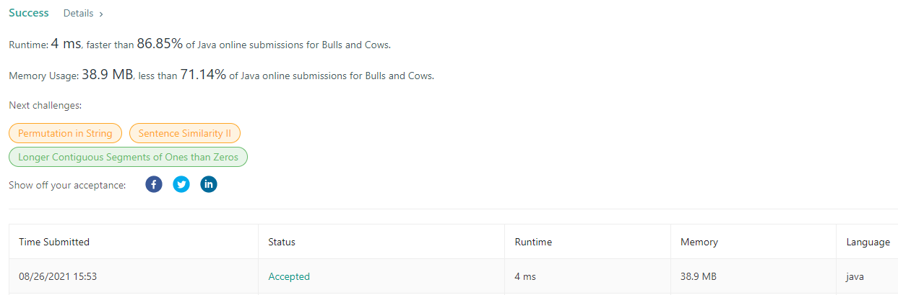

# [Bulls and Cows](https://leetcode.com/problems/bulls-and-cows/)

`Hash Table` , `String` , `Counting`

두 문자열 숫자(`secret`, `guess`)가 주어질 때 문자열을 비교하여 같은 문자가 있는지, 문자도 같고 위치도 같은지 찾는 문제

약간 숫자 야구게임이랑 비슷한거같다.

1. 위치와 숫자가 같으면 A(황소)다
2. 위치는 다르지만 `guess`의 숫자가 `secret`에 포함되어있으면 B(소)다.

**[_ex_]**  
secret이 "11234"이고 guess가 "00111"일 때 위치와 숫자가 같은 케이스가 없기 때문에 `0A`이다.  
secret의 "`11`"과 guess의 "`11`"이 위치는 달라도 같은 숫자이기 때문에 `2B`이다.  
여기서 guess에 1이 3개지만 secret에서 1의 개수만큼만 비교해야한다.

---

숫자 9개에 대한 배열을 만들어준다.
```
 int[] numbers = new int[10]
```
secret과 guess에서 숫자 하나씩 뽑아서 비교한다.
```
    int s = secret.charAt(i) - '0'; //ascii코드를 숫자로 바꾸기위해서 문자'0'을 빼준다.
    int g = guess.charAt(i) - '0';
```

비교 결과가 같으면 `bulls`에 1을 더해준다.
```
if( s == g ){
    bulls++;
}else{
    if(numbers[s]++ < 0) cows++;
    if(numbers[g]-- > 0) cows++;
}
```
비교 결과가 다르면 `numbers`배열값을 가지고 `cows`에 1을 더해준다. 

"11234"와 "00111"을 가지고 위 로직을 실행하면 아래와 같이 된다.

        s  1             1             2             3           4
        g  0             0             1             1           1
    index  0 1 2 3 4     0 1 2 3 4     0 1 2 3 4     0 1 2 3 4   0  1 2 3 4  
    value -1 1 0 0 0    -2 2 0 0 0    -2 1 1 0 0    -2 0 1 1 0  -2 -1 1 1 1
                                      cows + 1      cows + 1

위에서 나온 `bulls`와 `cows`를 조합하여 return한다.

