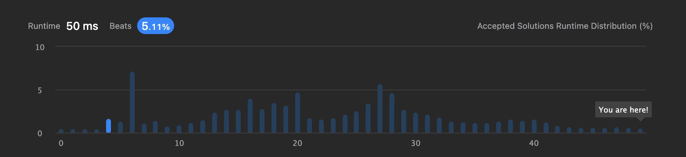
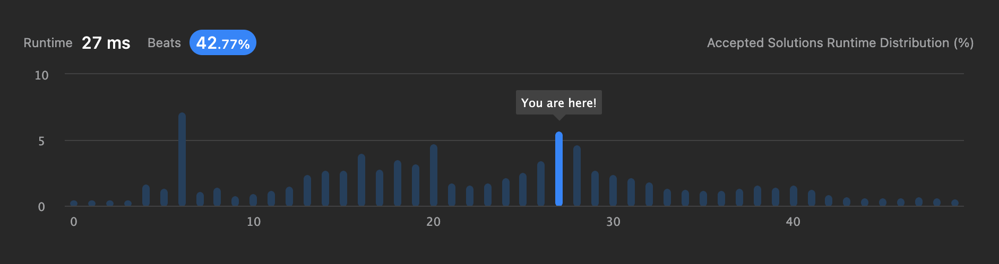

# [217. Contains Duplicate](https://leetcode.com/problems/contains-duplicate/)

```Easy```, ```Array``` , ```Hash Table```, ```Sorting```

중복된 값이 존재할 경우 `true`, 중복된 값이 없으면 `false`를 반환하는 문제

정렬 후 이전값과 비교해서 같은 값이면 `true`를 return 하도록 했다.


시간 복잡도는 O(n)이다.
- 정렬은 퀵소트로 이루어진 Arrays.sort 메서드를 사용했다 [O(NlogN)]

-----------

다른 사람들은 어떻게 풀었나 확인해보니 Set을 이용해서 중복값을 찾는 방법이 있었다.

Set을 사용하면 정렬을 할 필요가 없었다.
```java
Set<Integer> duplicate = new HashSet<>();
        
for (int num : nums) {
    if (duplicate.contains(num)) {
        return true;
    }
    duplicate.add(num);
}
return false;
```
runtime 시간이 50ms에서 27ms가 됐다!

- before

- after
