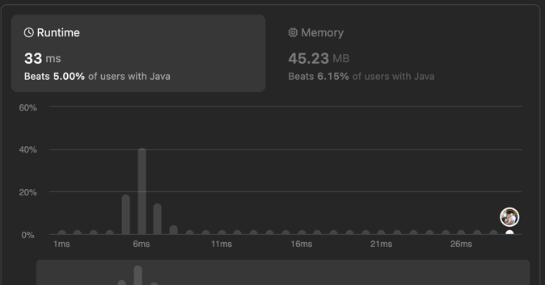
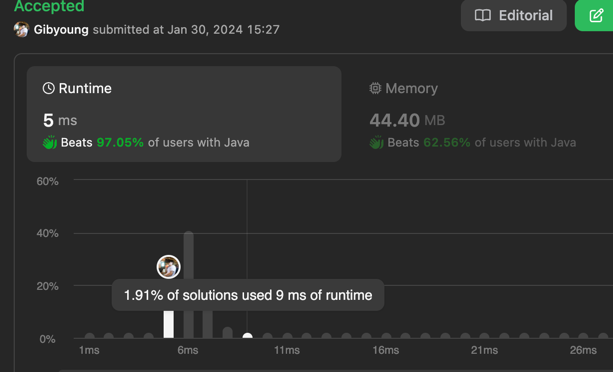

# [150. Evaluate Reverse Polish Notation](https://leetcode.com/problems/evaluate-reverse-polish-notation/)

```array``` , ```Stack```, ```Math```

역폴란드 표기법으로 되어있는 리스트로 결과값을 구하는 문제 

```text
역폴란드 표기법(RPN: reverse Polish notation)이란?
연산자를 연산 대상 뒤에 쓰는 연산 표기법으로 후위 표기법이라고도한다.
```

### 풀이방법
- 리스트를 반복문으로 돌려 숫자인지 연산자인지 확인한다.
- 숫자면 stack 저장소에 저장한다.
- 연산자면 stack 에서 두개의 값을 뺀 후 해당 연산자로 연산 후 다시 스택에 넣는다.
- 리스트가 다 돌면 리스트에 남아있는 값이 결과값이 된다.  
  

enum을 사용해서 문제를 풀었는데 다른 사람들은 switch문을 사용해서 문제를 풀었다.  
코딩테스트 관점에서 볼 때는 switch문이 괜찮아 보이고 실무 코딩실력 테스트를 볼 때에는 enum으로 처리하는게 괜찮아 보임!  

enum을 사용해서 그런지 효율적이지 못한 속도와 메모리다.



switch문으로 변경하니 시간이 확 줄었다.  



