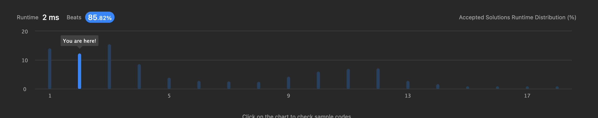

# [238. Container With Most Water](https://leetcode.com/problems/container-with-most-water/)

```Array``` , ```Prefix Sum```

배열 nums가 주어질 때 i번째 index에서는 nums[i]값을 제외한 모든 요소의 곱을 배열에 담아 return 해야한다.

나누기 연산을 사용하지 않고 제 시간에 실행되는 알고리즘을 작성해야 한다.

input = {1,2,3,4} 일경우
```text
output
0       2*3*4   24
1       1*3*4   12
2       1*2*4   8
3       1*2*3   6
```

index를 1부터 시작하여 왼쪽 값들의 곱을 구하고
반대인 경우에도 구해서 각 index끼리의 곱으로 결과를 구했다.

```
answer = {
    1,
    1(1),
    2((1) * 2),
    6(((1) * 2) * 3)
}
reverse = {
    24(((4) * 3) * 1),
    12((4) * 3),
    4(4),
    1
}
```

answer와 reverse 각 index의 값들을 곱한다.

시간복잡도는 O(2n)이며 상수를 제거하여 O(n)이된다.

걸린시간은 최소 2ms가 나왔다

