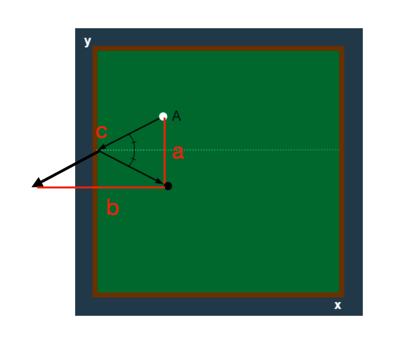

# [당구 연습](https://school.programmers.co.kr/learn/courses/30/lessons/169198)

`2 Level`

목표 공까지 원쿠션을 이용하여 맞출 때 가장 짧은 거리의 제곱을 구하는 문제입니다.

### 문제 풀이
- target ball을 상하좌우로 반전해서 피타고라스 정리로 길이를 구한 후 가장 짧은 길이를 구합니다.

- 위 그림에서 c의 제곱을 구하면 됩니다.
- 두 볼이 평행에 위치해 있을 경우 원쿠션이 안되는 상황을 체크합니다.
```text
[원 쿠션이 불가능한 경우]
위   :   startX == targetX && startY < targetY
아래  :   startX == targetX && startY > targetY
좌   :   startY == targetY && startX > targetX
우   :   startY == targetY && startX < targetX
```
- 각 방향별로 제외되는 계산 후 최소값을 계산하여 결과 배열에 추가합니다.
- 각 방향별로 계산 밑변과 높이 계산식이 존재합니다.
- 위, 아래 방향으로 공을 튕길때에는 x축의 차이값만 계산하면 됩니다.
- 마찬가지로 오른쪽, 왼쪽 방향으로 공을 튕길때에는 y축의 차이값을 계산합니다.
- 나머지 변의 값은 어느 벽에 더 가깝냐에 따라 값이 달라집니다.

```text
위   :   (2 * (n - targetY) + targetY) - startY
아래  :   2 * targetY + (startY - targetY)
좌   :   2 * targetX + (startX - targetX)
우   :   (2 * (m - targetX) + targetX) - startX
```