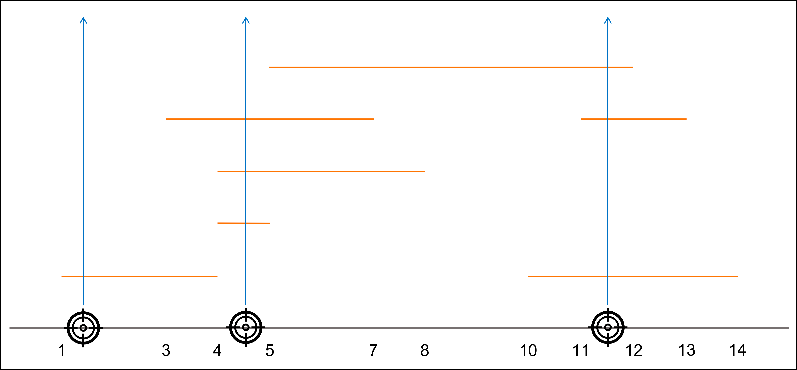

# [요격 시스템](https://school.programmers.co.kr/learn/courses/30/lessons/181188)

`targets`을 요격하는데 필요한 최소한의 미사일 수를 구하는 문제.

```text
입출력 예

targets : [[4,5],[4,8],[10,14],[11,13],[5,12],[3,7],[1,4]]

result : 3
```



- 정렬한다음 비교하는 방식으로 접근했다.
- `x`축 최소값부터 시작하여 `target`하나씩 비교하고 다음 `target`의 시작 지점이 이전 `target`의 범위에서 벗어나면 미사일 수를 증가시키는 방법으로 문제를 풀었다.

```java
class Solution {
    public int solution(int[][] targets) {
        // 문제에 target은 1부터 시작이므로 미사일의 최소값은 1이다.
        int answer = 1;

        Arrays.sort(targets, (Comparator.comparingInt(o -> o[0])));

        int start = targets[0][0];
        int end = targets[0][1];

        for (int[] target : targets) {
          int s = target[0];
          int e = target[1];

          // 시작 지점이 이전 target 범위에 포함 되는지 확인
          if (s >= start && s < end) {
            // 종료지점은 최소값으로 적용
            end = Math.min(end, e);
          } else {
            // 만약 시작 지점이 이전 target 에 포함되지 않는다면
            // 현재 target이 기준값이 된다. 
            end = e;
            // 미사일 수 증가
            answer += 1;
          }
          
          // 시작 지점은 계속 변경됨.
          start = s;

        }

        return answer;
    }
}
```