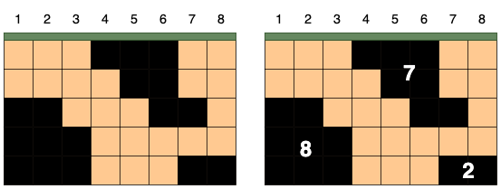
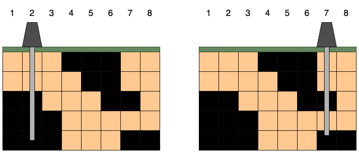

# [석유 시추](https://school.programmers.co.kr/learn/courses/30/lessons/250136)

2차원 배열에 석유가 들어있습니다.

시추관으로 열 하나를 관통하여 석유를 뽑을 수 있는데 이때 가장 시추관을 뚫어서 뽑을 수 있는 가장 많은 석유량을 구하는 문제입니다.



열과 열 사이에 시추관을 뚫을 수 없으며 아래 그림과 같이 해야합니다.



총 석유량은 시추관이 지나간 석유 덩어리를 모두 합한 값 입니다.

### 문제 풀이
- 모든 땅을 탐색하여 모든 경우의수를 구한 후 최대값을 구해야합니다.
- 효율성을 위해 이미 지나간 땅이나, 계산한 석유는 지나가도록 합니다.
- for문을 돌릴때 석유가 발견한곳부터 상,하,좌,우의 값들을 탐색합니다(bfs 사용).
- 방문변수를 사용 할 수도 있지만 메모리 효율을 위해 석유가 들어있는 2차원 배열을 사용하여 방문한 배열은 `0`으로 바꿔서 다음 loop때 탐색하지 않도록 합니다.

```java
public int solution(int[][] land) {
    int row = land.length;
    int col = land[0].length;

    // 각 열별 총 석유량을 나타내는 변수.
    int[] oilCount = new int[col];

    for (int r = 0; r < row; r++) {
      for (int c = 0; c < col; c++) {
        if (land[r][c] == 1) {
          // 탐색
          bfs(land, r, c, oilCount);
        }
      }
    }

    return Arrays.stream(oilCount)
        .max()
        .orElse(0);
  }

  private void bfs(int[][] land, int r, int c, int[] oilCount) {
    // 방문할 석유의 좌표가 들어있는 큐.
    Queue<int[]> q = new LinkedList<>();
    // 최초 발견된 석유 입력.
    q.add(new int[]{r,c});

    // 석유 사용.
    land[r][c] = 0;

    // 석유가 발견된 열 위치.
    Set<Integer> drilling = new HashSet<>();

    // 총 석유량.
    int count = 1;

    // 최초 석유가 발견된 열 추가.
    drilling.add(c);
    
    // 발견된 석유와 인접한 석유를 찾아내기위해 필요한 값들.
    int row = land.length;
    int col = land[0].length;
    int[][] xy = {{-1, 0}, {0, 1}, {1, 0}, {0, -1}}; // 상, 우, 하, 좌

    while(!q.isEmpty()) {
      // 현재 석유 위치.
      int[] curr = q.poll();
      // 석유가 발견된 열 추가.
      drilling.add(curr[1]);

      for (int[] v : xy) {
        int x = v[0];
        int y = v[1];
        int nx = curr[0] + x;
        int ny = curr[1] + y;

        // 범위에서 벗어나거나 석유가 존재하지 않는 곳이라면 지나간다.
        if (nx < 0 || nx >= row || ny < 0 || ny >= col || land[nx][ny] == 0) {
          continue;
        }

        // 석유를 발견하면 큐에 좌표 저장.
        q.add(new int[]{nx, ny});
        // 해당 위치 석유 사용.
        land[nx][ny] = 0;
        // 총 석유량 + 1.
        count += 1;
      }
    }

    // 석유가 발견된 열에 총 석유량을 합산한다.
    for (Integer field : drilling) {
      oilCount[field] += count;
    }
  }
```

